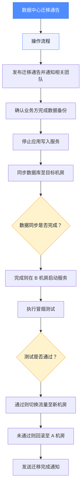

# 数据中心迁移通告（含流程图）

**发布时间**：2026-05-28  
**影响范围**：核心业务系统、报表服务

## 操作流程

1. 发布迁移通告并通知相关团队
2. 确认业务方完成数据备份
3. 停止应用写入服务
4. 同步数据库至目标机房
5. 数据同步是否完成？
6. 完成则在 B 机房启动服务
7. 执行冒烟测试
8. 测试是否通过？
9. 通过则切换流量至新机房
10. 未通过则回滚至 A 机房
11. 发送迁移完成通知

## 流程图

