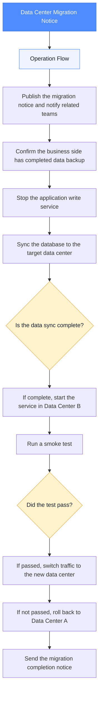

# Data Center Migration Notice (with Flowchart)

**Release time**: 2026-05-28  
**Affected scope**: Core business systems, reporting services

## Operation Flow

1. Publish the migration notice and notify related teams
2. Confirm the business side has completed data backup
3. Stop the application write service
4. Sync the database to the target data center
5. Is the data sync complete?
6. If complete, start the service in Data Center B
7. Run a smoke test
8. Did the test pass?
9. If passed, switch traffic to the new data center
10. If not passed, roll back to Data Center A
11. Send the migration completion notice

## Flowchart

